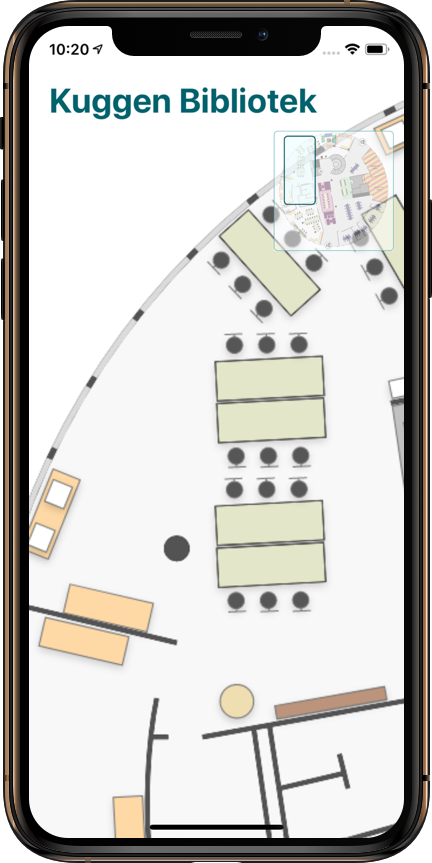
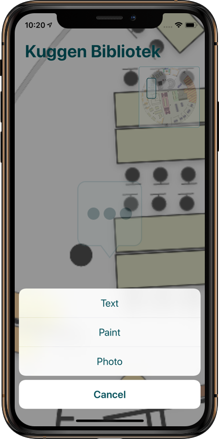
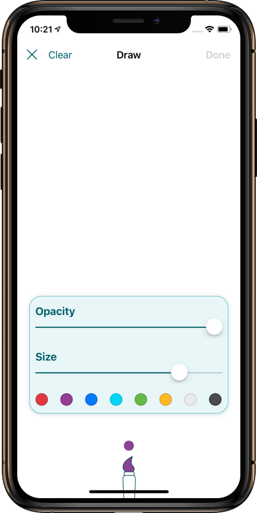
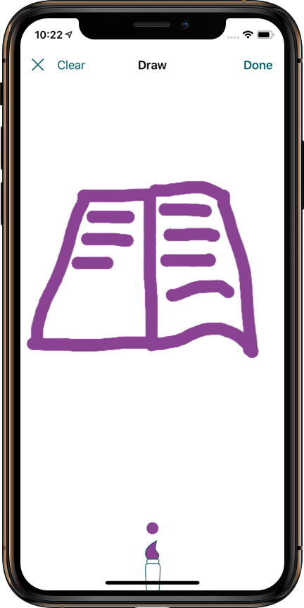
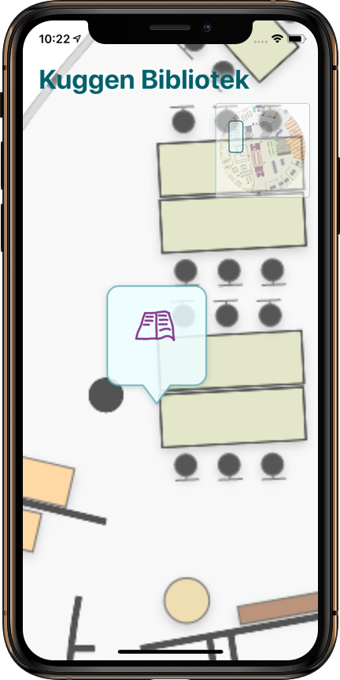
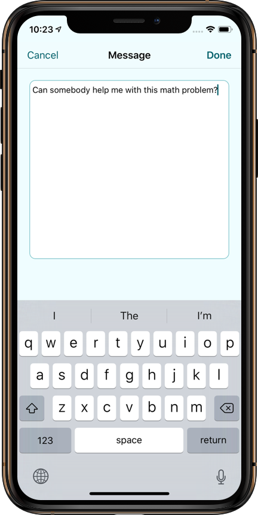
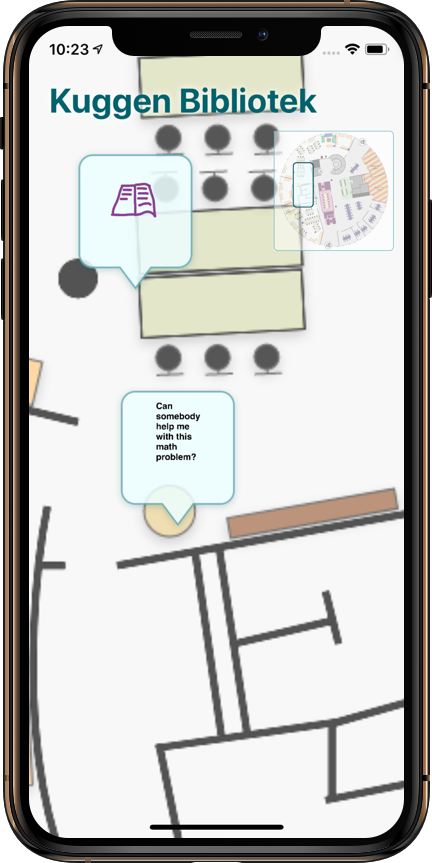
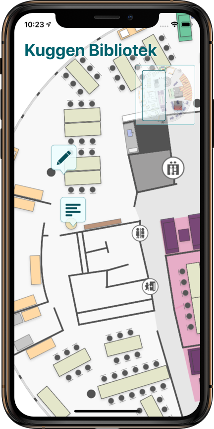

#  Canary
A social library tool.
An interactive map for people at libraries in order to easier communicate with each other.

Group project for the course CIU196 Mobile Interaction, Fall 2018, Chalmers University of Technology.

## The team
* Carl Albertsson
* Daniel Roeven
* Kristoffer Knutsson
* Simon Takman
* William Falkengren

## Design
  
  
   
 

## Technologies used
* Swift 4
* Cocoapods
* Firebase
* Lottie-ios

## Setup & run
1. Clone this repository
2. Open MobileComputingProject/MobileComputingProject.xcworkspace in xcode
3. Switch Apple developer to your account.
4. Build & run application
